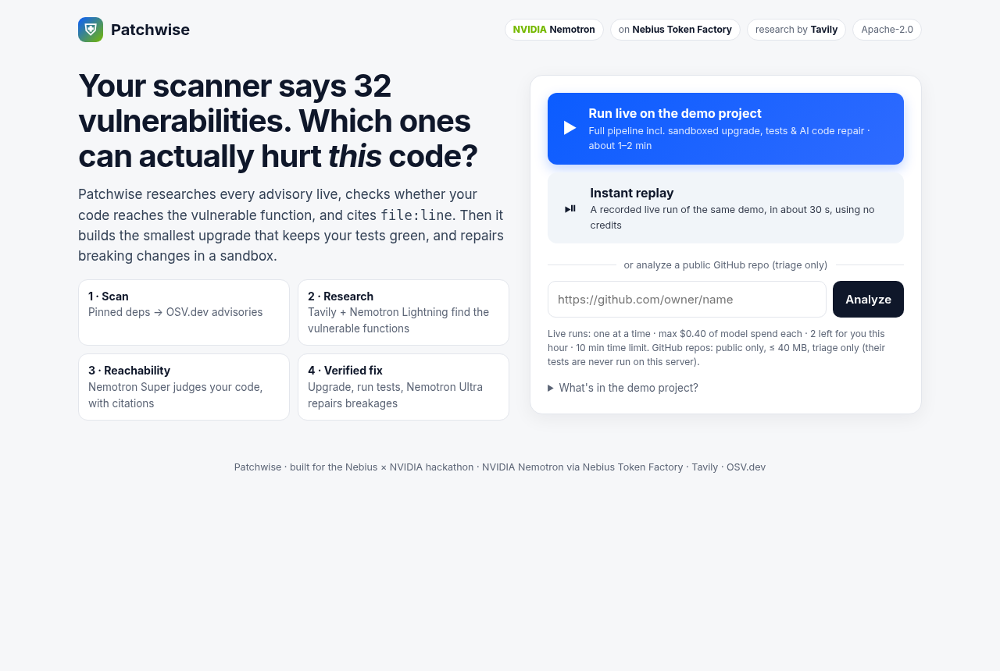
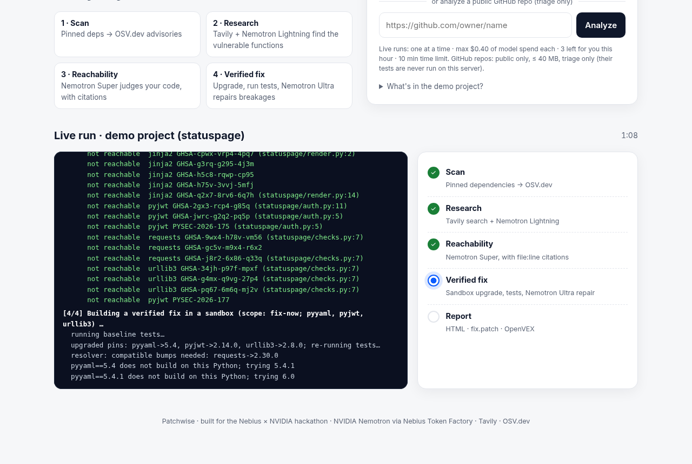
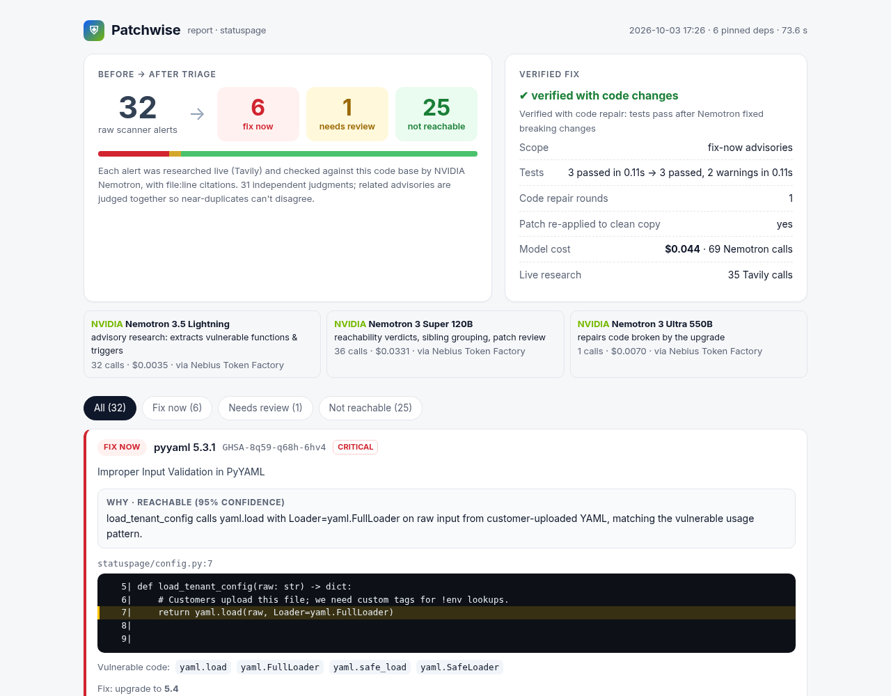
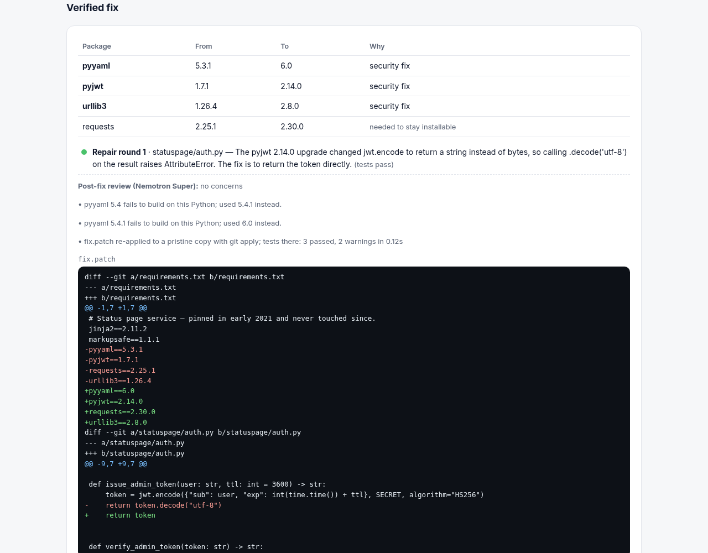

# Patchwise

[](LICENSE)
**Open source under the [Apache License 2.0](LICENSE).**

**Your scanner reports 32 vulnerabilities. Patchwise tells you which ones your code can actually
reach, cites the line, and gives you the smallest upgrade that keeps your tests passing, with
breaking changes already repaired.**

Built for the Nebius × NVIDIA hackathon (Coding & Agentic track) on
**NVIDIA Nemotron** models served by **Nebius Token Factory**, with live advisory research by **Tavily**.



## Built with NVIDIA Nemotron on Nebius Token Factory

Every model call goes through Token Factory's OpenAI-compatible API
(`https://api.tokenfactory.nebius.com/v1/`). Each step uses the cheapest Nemotron tier that is good enough for it:

| Step | Nemotron model (Token Factory ID) | What it does | Price in / out per 1M tokens |
|---|---|---|---|
| Advisory research (high volume) | **Nemotron 3.5 Lightning** `nvidia/Nemotron-3_5-Lightning` | Reads OSV text plus Tavily results and extracts *which code* is vulnerable: functions, options, trigger conditions, and the OS the flaw is limited to | $0.06 / $0.24 |
| Reachability + sibling grouping + patch review | **Nemotron 3 Super 120B** `nvidia/nemotron-3-super-120b-a12b` | Groups near-duplicate advisories, then decides *reachable / not reachable / uncertain* from AST evidence and full source, citing `file:line`. It also reviews the final diff for behaviour changes | $0.30 / $0.90 |
| Code repair after upgrades | **Nemotron 3 Ultra 550B** `nvidia/Nemotron-3-Ultra-550b-a55b` | Called only when tests break after the upgrade. It reads the failures and migration notes, then edits application code (never tests, never security settings) | $1.00 / $3.00 |

Thinking is turned off for the fast tier and on for reasoning and repair (via `chat_template_kwargs`). Each report
shows the calls, tokens and dollar cost per model. A full demo run (32 advisories, verified fix, one repair) costs
**about $0.04**. Override models with `PATCHWISE_MODEL_FAST`, `PATCHWISE_MODEL_REASON` and `PATCHWISE_MODEL_DEEP`.

## How Tavily is used
- **Search** (`search_depth: advanced`): one query per advisory finds write-ups, fix commits and PRs that name
  the vulnerable function, which OSV records usually omit.
- **Extract**: the fix commit or PR linked from the advisory is pulled in full, because the patch itself shows exactly which code changed.
- **Migration notes**: when an upgrade breaks the tests, Patchwise searches for the package's changelog and
  migration guide and hands them to Nemotron Ultra together with the failures.
- Works with a `TAVILY_API_KEY`, or in Tavily's keyless mode (rate-limited) when no key is set.

## What it does
1. **Scan.** Finds pinned dependencies (`requirements*.txt`, `requirements/*.txt`, `package-lock.json`) and looks them up
   on [OSV.dev](https://osv.dev). Duplicate GHSA/PYSEC/CVE records are merged.
2. **Research** (Tavily + Lightning). Extracts the vulnerable symbols, trigger conditions and platform limits for each advisory.
3. **Reachability** (Super). Builds an AST index of imports, call sites and Jinja template filters. Then:
   - **Consistency:** sibling advisories (same vulnerable feature and preconditions) are judged together. A
     deterministic guard stops the model from merging unrelated flaws.
   - **Platform:** advisories limited to another OS (for example Windows `safe_join`) are not reachable on a Linux deploy (`--deploy-os`).
   - **Dev/test-only dependencies:** packages pinned only in dev requirements, or imported only from tests, drop to *review* instead of *fix now*.
   - **Transitive and framework use:** packages used through a wrapper count as reachable (requests → urllib3,
     Flask → Werkzeug), including optional extras the wrapper uses automatically (urllib3 decodes brotli responses
     whenever brotli is installed).
4. **Verified fix** (Ultra). By default only the **fix-now** advisories are upgraded (`--fix-scope review|all` to widen it), each
   to the lowest patched version. The resolver adds only the companion bumps needed to stay installable. The tests run in a sandbox.
   If they break, Ultra repairs the code, up to 8 rounds. Super then reviews the diff. The final `fix.patch` is
   re-applied with `git apply` to a clean copy and tested again.
5. **Output.** A report (HTML, Markdown, JSON), `fix.patch`, and an **OpenVEX** document so Grype or Trivy can suppress
   alerts that are proven unreachable. There is also a CI gate: `--fail-on fix-now`.

| Live agent log | Report |
|---|---|
|  |  |



## Setup

Requirements: Python ≥ 3.10, [uv](https://docs.astral.sh/uv/), git. You need a Nebius Token Factory API key from
<https://tokenfactory.nebius.com>. A Tavily key is optional.

```bash
git clone <this repo> && cd patchwise
uv venv && . .venv/bin/activate
uv pip install -e '.[dev]'

export NEBIUS_API_KEY=...        # Nebius Token Factory
export TAVILY_API_KEY=...        # optional; keyless Tavily is used otherwise

patchwise demo/statuspage                  # CLI: writes demo/statuspage/.patchwise/report/
uvicorn patchwise.web:app --port 8000      # web demo on http://localhost:8000
pytest -q                                  # 25 offline tests (scripted model, no key needed)
```

### CLI options
| Flag | Meaning |
|---|---|
| `--no-fix` | Triage only |
| `--fix-scope fix-now\|review\|all` | Which advisories the verified fix upgrades (default `fix-now`) |
| `--deploy-os linux\|windows\|macos` | Deployment OS for platform-limited advisories (default `linux`) |
| `--python 3.11` | Python version for the test sandbox |
| `--test-cmd "..."` | Test command (default `python -m pytest -q`) |
| `--requirements FILE` | Requirements file(s) to install for tests (default: all found) |
| `--with PKG==VER` | Extra test-only packages (dropped automatically if they conflict with the fix) |
| `--max-cost 0.50` | Hard USD ceiling on model spend for the run |
| `--fail-on fix-now\|review` | CI gate exit code |

**GitHub Action:** [`examples/github-action.yml`](examples/github-action.yml) runs Patchwise on every pull request that
touches dependencies and fails the check when a reachable vulnerability is found. Copy it to `.github/workflows/patchwise.yml`
in your repo and add `NEBIUS_API_KEY` (and optionally `TAVILY_API_KEY`) as repository secrets.

Other settings come from environment variables: `PATCHWISE_MAX_REPAIRS` (default 8), `PATCHWISE_MAX_COST` (default $1), and
`PATCHWISE_SPEND_LOG` (path to a JSONL cost ledger).

## Web demo
The web app (`patchwise/web.py`) needs no setup from the person using it:
- **Run live on the demo project:** one click runs the full pipeline on `demo/statuspage`. It streams the agent log, then shows
  a before/after summary card and the full report.
- **Instant replay:** a recorded live run of the same demo, shown in about 30 s. It uses no credits, so judges see
  results even if model credit runs out.
- **Public GitHub repo:** paste `https://github.com/owner/name` for a triage-only run.

Guards for a public deployment (all configurable via environment variables):
- **Cost:** each run is capped at `PATCHWISE_WEB_MAX_COST` ($0.40). A daily budget (`PATCHWISE_DAILY_BUDGET`, $0.50 in the container) switches live runs off and leaves the replay available.
- **Load:** one live run at a time (`PATCHWISE_MAX_CONCURRENT`), 3 runs per hour and 8 per day per IP, and a 10-minute wall-clock limit (the run is a killable subprocess).
- **GitHub repos:** public only, at most 40 MB (checked during a monitored shallow clone), and **triage only**. Their tests are never executed on the server.
- **Secrets:** API keys exist only in the server environment. Project code (installs, tests) runs with every
  `*KEY*/*TOKEN*/*SECRET*` variable removed. Log lines are scrubbed of key values and server paths.

## Demo project
`demo/statuspage` is a small service pinned in 2021: jinja2 2.11, PyYAML 5.3.1, PyJWT 1.7.1, requests 2.25 and urllib3 1.26.
It has 32 advisories. Among them are a real reachable RCE (PyYAML `FullLoader` on customer-uploaded YAML), many non-reachable
issues (for example PyJWT key confusion is ruled out by `algorithms=["HS256"]`), and an upgrade that breaks the code (PyJWT 2's
`encode` returns `str`). Nemotron Ultra repairs that break automatically.

## Results on real repositories
See [docs/RESULTS.md](docs/RESULTS.md): demo, microblog, searx and flasky, with verdict counts, verified-fix outcomes,
costs and a hand spot-check of the verdicts, including known failure modes.

## Safety
- Tests run in a copied sandbox with its own venv, as a non-root user in the container. For untrusted repositories, run Patchwise in a container or VM.
- Model edits are confined to the sandbox. They cannot touch requirements or tests, and a guard rejects edits that weaken security (for example `yaml.unsafe_load`).
- The OpenVEX output is marked "automated; review before publishing".

## Deploy
`Dockerfile` builds the web demo for any container host. `fly.toml` is a prepared Fly.io config. Inject
`NEBIUS_API_KEY` (and optionally `TAVILY_API_KEY`) as secrets; never bake them into the image.

## License
Apache License 2.0. See [LICENSE](LICENSE).
